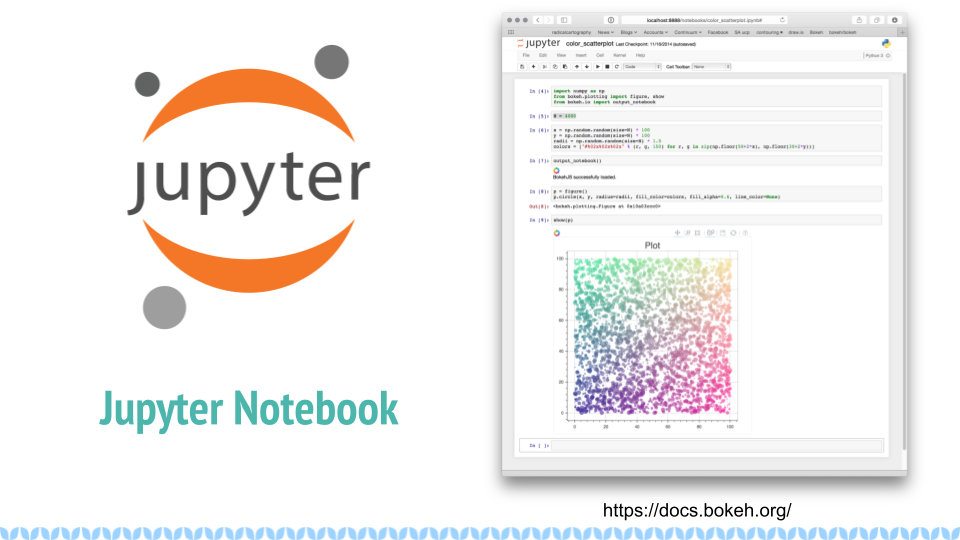

PyCon 2021 Presentation - pyKnit: Math Tools For Knitters
=========================================================

`Original slides with notes <https://docs.google.com/presentation/d/1Kr7Nmzgs5RCqx3kxyMDXwGNGe9Skq8E4bquLQhI3fdo/edit?usp=sharing>`_ (Link goes to Google Slides)

This is the collection of written notes I made with each slide.  It's not the same as a transcript, but it's roughly what I wanted to say before I started recording, so it should be somewhat close.

0. pyKnit: Math Tools for Knitters (title slide)
------------------------------------------------

  Title slide reads as follows

* pyKnit: Math Tools for Knitters.
* Terri Oda, PyCon 2021.

1. Hi, I'm Terri
----------------

  Slide reads "Hi, I'm Terri" and features a picture of the speaker, a multiracial woman wearing a colourful knitted shawl around her neck like a scarf.

Hi, I’m Terri.  Normally, I talk about security, open source, mentoring, or artificial intelligence, but right now I’m on sabbatical so let’s talk about knitting.

* Shawl: `Symphony by Tabetha Hendrick, yarn from Sweet Georgia Yarns <https://sweetgeorgiayarns.com/shop/symphony/>`_

2. What is Knitting?
--------------------

  Slide features a two-coloured pink and peach lace shawl in progress on metal knitting needles, as well as a motif of blue "v" shapes at the bottom meant to represent knit stitches.

Probably if you chose to watch this talk you already know what knitting is, but just in case you want a refresher, it’s a process where you take a long length of yarn and turn it into a stretchy fabric by making a series of interlocking loops.  Knitting can be done by machines, and there’s a good chance you’re wearing some knit fabric right now: if you look at a t-shirt very closely you’ll see that it’s made teensy tiny little v’s of thread like the pattern I have on the bottom of my slides.  Many knit fabrics are made by machine, but today we’re going to talk about hand knitting, the stuff done with two pointy sticks and yarn.   

* Shawl: `Romi Mystery 2021 <https://www.ravelry.com/patterns/library/romis-2021-spring-mystery-shawl-kal>`_
* Yarn: `Romi Mystery 2021 kit from A Verb For Keeping Warm <https://www.averbforkeepingwarm.com/>`_

3. Tools for Knitters
---------------------

  Slide reads "Tools for Knitters" and contains some pictures described in more detail below.

When you think about tools for knitters, you probably think of yarn, knitting needles, maybe scissors (show all of these), a nice bag to carry things in.  If you’re actually a knitter you probably have a few more on hand, like stitch markers, a special ruler (show), an application for handling charts (show knitcompanion but make sure to use one of my charts).  If you're not a knitter, you probably didn't picture a calculator or a spreadsheet.

Upper left photo:

* `Yarn ball holder from Hansen Crafts <https://hansencrafts.com/knitting-crochet-tools/yarn-ball-holder/>`_ 
* Yarn: `The Fiber Co. Arranmore Light in Finian <https://thefibreco.com/product/arranmore-light/>`_
* Sweater in progress: `Stepping Stones Cardi by Rebecca McKenzie <https://www.ravelry.com/projects/terriko/stepping-stones-cardigan>`_

Upper Right photo: 

* `Dollyville Care Package from KnittedWit and others <https://www.etsy.com/listing/1006196101/dollyville-care-package?ref=shop_home_active_1&crt=1>`_

Bottom photo: 

* Miscellaneous tools from `Katrinkles Knitting Jewelery <https://www.katrinkles.com/>`_, including a sock ruler, sheep-shaped yarn holders, a stitch marker necklace, stitch markers, and tags.

4. The origin of pyKnit
-----------------------

.. figure:: Pycon2021-Slides/pyKnit-PyCon2021-4.png

  Slide reads "pyKnit: math tools for knitters" and features a colourful striped sock in progress.

I got tired of using my calculator and spreadsheet to figure things out, and thought “why isn’t there a library for this?” and that’s how pyKnit was born.  It’s an open source project, written in python, that helps you do knitting math, which can be surprisingly involved and is actually more like solving algebraic equations than balancing a chequebook.  I love algebra enough that I got a whole degree in mathematics, but deriving equations over and over gets tedious.

* Knitting: `2020 Advent Sock kit from MadeBySarahS <https://www.madebysarahs.net/>`_
* Stitch Marker by `Wee Ones Creations <https://www.etsy.com/shop/weeones>`_
* `Ghost Whale organizer pouch from Tom Bihn <https://www.tombihn.com/products/ghost-whale-organizer-pouch>`_

5. Where is the math in knitting?
---------------------------------

  Slide reads "Where is the math in knitting" and features a picture of a colourful brioche knit shawl in progress.

In order to understand why this is a great tool to add to your kit, you have to understand where and why we do math in knitting.  I’m not going to cover all the possible ways, but here’s a couple of very common places where it matters.

* Knitting: `Syncopation Shawl by PDXKnitterati <https://pdxknitterati.com/patterns/patterns-shawls-and-wraps/syncopation/>`_ (This great pattern also contains weight information which helped me resize the border!)
* Yarn: Gradient from Fierce Fibers in colour “Sinnerman” https://fiercefibers.com/ , sparkly charcoal from Anzula Fiber Arts https://anzula.com/ 
* Bag from Tom Bihn https://www.tombihn.com/
* Helmet from Nutcase

6. Gauge: converting stitches or rows to measurements
-----------------------------------------------------

  Slide reads "Gauge: converting stitches or rows to measurements" and features a knit gauge swatch and a ruler showing that it is 4 inches tall.  The gauge measurements listed next to it read "Gauge: 21 stitches and 31 rows = 10cm in Stockinette Stitch (Flat)"

Number 1, let’s talk about gauge.  When you see this in a knitting pattern, it looks like this: 21 stitches and 31 rows = 10 cm in Stockinette Stitch, knitted flat.  So before you knit the pattern, you cast on 21 stitches and knit 31 rows, then take your little square and wash it and dry it and measure it.  If you get exactly what the pattern says then you’re done and the math in the pattern will all work out for you.  If you didn’t quite get it, you can change needle size or yarn and try again until you do.  But if it doesn’t match, none of the measurements you get will be the same as what’s written.  For some projects, that doesn’t matter: if my scarf is 10% too long, I’m probably not going to notice.  But if my sweater is 10% too small, then there’s a good chance it’s not going to fit correctly.  So if you don’t get the correct gauge, you’ve got to be prepared to do a bunch of calculations yourself.

More gauge resources: https://blog.tincanknits.com/2013/08/17/gauge/

* Yarn: `The Fiber Co. Arranmore Light in Finian <https://thefibreco.com/product/arranmore-light/>`_
* Ruler: `KnitPicks View Sizer <https://www.knitpicks.com/view-sizer/p/80306>`_

7. Shaping: Increasing & Decreasing Size
----------------------------------------

  Slide contains the text "Shaping: Increasing & Decreasing Size" and contains a diagram from TinCanKnits showing a sweater in progress.

Next up is shaping.  If you’re knitting a sweater, you’re going to have a number of places where measurements change from one to another.  Probably the simplest to understand is a sleeve.  Your arm circumference at your shoulder or bicep is much larger than your arm measurement down at the wrist.  In the most common type of sleeve, you want to change smoothly from one measurement to the other to match the curve of your arm.  There’s lots of variants for fashion, but you can’t, say, put all the decreases at the top and expect that to fit most people.  Sometimes a pattern will just say “decrease evenly until you have X stitches” and it’s up to the knitter to figure out how to do that using (gasp) math, sometimes they’ll give explicit places to put those increases.  

* Link to sweater diagram: https://blog.tincanknits.com/2013/10/25/lets-knit-a-sweater/

8. Math for sleeve decreases
----------------------------

  Slide features some equations (described below) and the same sweater diagram as on the previous slide.

::

  Given…
  wrist_circumference 
  bicep_circumference
  arm_length
  cuff_length
  decreases_per_row

  We want a pattern something like..
  [decrease row, knit x rows in pattern] repeat y times

  Such that...
  wrist_circ = bicep_circ - (decreases_per_row * y) 
  and
  arm_length = (x+1) * y + cuff_length

  Convert to stitches instead of measurements, solve for x and y but use only integers and spread out the remainder evenly too...

So if you’re customizing a sleeve, it starts out like this.  You know the length of your arm and how big you want the cuff to be, you’ll know the circumference you want at the bicep and wrist (which may be a bit bigger than your actual body measurements), so you figure out how much you want to decrease by subtracting the wrist measurement from the bicep one, then you figure out the length you want your decreases in, then you divide them… except remember, you can’t do this in measurements, you need to do it in stitches, which means you can only use integer numbers and have to deal with remainders somehow.  And then you might want to decrease more than one stitch per row (in fact 2 is the most common case) so …  It gets tedious to figure it all out every time.  And that’s for a simple sweater without much pattern, it gets much more complicated if you need to make sure the decreases fit into a lace pattern, for example.

9. Shawl Shape Algorithms
-------------------------

  Slide reads "Shawl Shape Algorithms" and has pictures of some common shapes alongside equations.

A sleeve is basically a tube with different sized ends, but you can work all sorts of different shapes.  When you start looking for patterns you can see how knitting relates to geometry.  The first row has some pretty straightforward shapes: a rectangle where the size of each row remains constant.  A triangle where the length of each row increases each time, and a bias knit where the size of the row doesn’t change, but you put increases on one end and decreases on the other to move the pattern over with each row.  Then on the bottom you start to see shapes that occur in part because of the properties of the fabric you create and how it stretches -- a crescent shape which has extra increases on the edges, or a circular “pi shawl” shape with only a few increase rows with specific spacing.

10. Knitting Code
-----------------

  Slide title reads "Knitting Code" and shows a knitting chart alongside a written version of Row 16: "kfb, k to marker, \*l cable, r cable, k to marker, repeat from \* until you reach last marker, l cable, r cable, k3,  k2tog, k1"

In fact, if you look at a knitting chart, this symbols out of string thing is pretty explicit.  Here’s a knit chart I made as part of a shawl pattern, and down below is a written version.  Many knitting patterns come with both written and charted instructions because different people find one or the other easier.  In this chart on row 16, we’re reading from right to left, but you actually swap which direction you read the chart in based on the direction you’re going on the knitted piece. (show on finished piece.)  Down at the bottom you can see row 16 written out in a somewhat typical knitting shorthand.

The rest of the Patio Stones pattern (it's free, but only has charts right now): https://curiousity.ca/2020/patio-stones-pattern-preview/

11. Knitting translated to Python
---------------------------------

  Slide shows the code and knitting written directions below

::

  def row16():
    knit_front_back()
    while not marker:
      knit()
    for repeat in repeat_sections:
      left_cable(1)
      right_cable(1)
      while not marker:
        knit() 
    left_cable(1)
    right_cable(1)
    for i in range(3):
      knit()
    knit_two_together()
    knit()

Row 16: kfb, k to marker, * l cable, r cable, k to marker, repeat from * until you reach last marker, l cable, r cable, k3,  k2tog, k1

For those of you who know more python than knitting, on the left there’s an interpretation of what that would look like.  Honestly, sometimes I miss whitespace in knitting patterns.  Because patterns were traditionally published in magazines, and people often still print them out or view them on phones or tablets, the syntax can be very terse.  Repeating a motif is common, and you can use stitch markers to note where the pattern changes or repeats happen.

12.  Is knitting Turing complete?
---------------------------------

  Slide reads "Is knitting Turing complete?" and shows a picture of a modern turning machine from https://aturingmachine.com/, which looks like long tape on two rolls with some electronic equipment in the middle that can perform operations on the tape.

Those of you with a classical computer science education may be thinking “wait, a long thread with a series of symbols sounds really familiar… is knitting Turing complete?” and the answer is yes, but I’ll leave you to search for the proof yourself.

13. Code reuse
--------------

  Slide shows a diagram of the parts of a sock from https://blog.tincanknits.com/2013/10/03/socks/ as well as a picture of a knitting stitch dictionary.

Once you start thinking of knitting patterns as a programming language for 3d printing stretchy fabric, you’ll notice some other similarities.  Larger knitting projects are made up of smaller components that can be swapped in and out.  For example, there’s a few different ways to do sock toes, and you can swap them in and out of patterns to match the shape of your own foot.  Similarly, there’s lots of different ways to do heels.  Or the cuff at the top.  Or different patterns of stripes.  (show all of these)

14. Why more tools?
-------------------

  Slide reads as follows:
  * Knitting is math.
  * Knitting is code.
  * Why do we need more tools?

15. Customization &  Size inclusive patterns
--------------------------------------------

  Slide reads "Customization & Size inclusive patterns" and features a diagram showing measurements in a sweater from https://tincanknits.com/pattern/flax

You probably know ways in which your body differs from average: maybe your foot is a bit wider, maybe you’re a bit shorter.  If you know how to do the math, it’s pretty easy to customize many types of garments to fit you by changing the measurements. But a lot of people are very intimidated by math, so they either get stuck making garments that don’t fit, searching endlessly to find a pattern where the designer’s sizes line up with their own, or they decide that they’re just not capable of knitting a sweater.  And I don’t know about you, but it makes me kind of sad.  

One of the hot topic issues in knitting lately has been size-inclusivity.  On one hand, it’s awesome to be able to accommodate more types of bodies.  On the other hand, knitwear designers aren’t paid super well and grading a pattern for many sizes is expensive and may require more test knits, photography, etc. Making the math part easier could help designers keep costs down, or could help knitters make their own modifications more easily.

16. Interactive patterns
------------------------

  Slide reads "Interactive patterns" and features a screenshot of a knitting decrease calculator from https://www.worldknits.com/knitting-calculators and some equations from https://ysolda.com/blogs/journal/a-magic-formula-for-evenly-distributing-shaping

One of the things I really want to be able to do is help provide interactive patterns where people can fill in their measurements and gauge and get instructions that fit their bodies and their yarns.  Now if I were selling you on a startup I’d claim that this is a disruptive innovation in the staid world of knitting and you should give me all your venture capital and get in on the ground floor of knit-tech.  But, I’m an open-source hippie on sabbatical so I’ll tell you that many clever designers already do this, a javascript calculator on a website, sharing equations in a blog post or a book, or even full subscription-based web applications to customize specially designed sweater patterns for your individual measurements.   

17. Free. Open Source.
----------------------

  Slide reads "Free. Open Source." and shows a picture of Terri's feet wearing knit socks and her toddler's bare feet beside them.

But the tools are scattered, they’re not all free, and they’re generally not open source, so I felt like there was space for something new anyhow.

* Socks: (Modified) `Sundae Socks by Shannon Squire <https://shannonsquire.com/knit-them-sundae-socks/>`_  
* Yarn: `Must Stash Yarns <https://muststashshop.com/>`_ 

18. Why Python?
---------------

  Slide reads "Why Python?" and features a oracle deck style card that says "love. I will choose love" and yarn from Knitted Wit on top of a shawl in progress.

Why Python?  The easiest answer is that I love python, but it's not the only answer.

* Knitting: Attitude of Gratitude kit from `ShannaJean <https://www.etsy.com/shop/ShannaJeanClub>`_

19. Pythonistas love knitting
-----------------------------

  Slide reads "Pythonistas love knitting" and shows a picture of a pair of fingerless gloves with a Mandalorian helmet and baby Yoda on them.

Every time I go to a conference, I bring my knitting. I hope many of you are knitting right now!  I like to joke that it’s like fidgeting only at the end of the conference I have a new pair of mitts.  It’s also great for in-person conferences if you’re feeling a bit introverted because it gives people an excuse to strike up a conversation with you.  So I can tell you that there’s a pretty decent number of PyCon attendees who knit.  And that matters to me when choosing a language for an open source project because I don’t just want users, I want people who feel empowered to make the software better. 

* Knitting: `Mando mitts <https://www.ravelry.com/patterns/library/mando>`_
* Yarn: Studio Donegal Darnie from https://www.blacksheepfiberemporium.com/ 

20. Jupyter Notebook
--------------------

  Slide reads "Jupyter Notebook" and shows the Jupyter logo as well as a screenshot of a pretty graph from https://docs.bokeh.org/

And then the other reason is really Jupyter Notebook.  When I was a grad student, it transformed how my lab shared data and made graphs, so it’s my first thought for interactive code where I want to be able to make charts, even if they’re knitting charts instead of scientific data.  Is it the best choice?  Running a notebook server would be a big ask for many random knitters and designers, so maybe not.  But for me to prototype the library and see how everything works?  It’s awesome.  

21. Sweater Sleeve Decrease Example
-----------------------------------

  Slide is titled "Sweater Decrease Example" and the code is shown in the text below.

So what does pyknit actually look like?  Not much yet!  But remember those sleeve calculations?  Here’s what it looks like in pyknit::

  import pyknit
  sweaterSwatch = GaugeSwatch(row_count=18, row_measure=3.25, stitch_count=24, stitch_measure=4, units="in")
  # shorten sleeve decrease section to 11 inches
  sleeve_rows = sweaterSwatch.measurement_to_rows(11)  
  # sleeve_rows is 61
  # starting bicep stitch count and ending wrist stitch count from pattern, because they were ok
  print(pyknit.sleeve_decreases(sleeve_rows, starting_count=59, ending_count=43, decrease_per_row=2))

I wear a fairly large fitness tracker and have discovered that I don't love having it stuck underneath my sweater sleeve, so I was aiming to make a shorter sleeve based on my personal measurements. (note that the "Swatch" class was renamed to "GaugeSwatch" later in development)

You can see from my swatch information that I hadn't gotten the expected gauge, because my row measure was 3.25 inches instead of the expected 4.  So I definitely needed to do the math here even if I hadn't wanted particularly short sleeves.

This particular pattern had you knit straight from the shoulders for a few inches, so I measured my arm from that point (while wearing the unfinished sweater) to the position above my wrist where I wanted the sleeve to end, and got 11 inches.  We use the GaugeSwatch class to convert that measurement to rows and get 61 rows.

My stitch gauge for this pattern was correct and I liked the measurements, so I use the starting stitch count and ending stitch count from the pattern.  This pattern also uses the common 2-decreases per decrease row for a sleeve.

This code gives the following output::

  [decrease row, do 7 rows in pattern] * 5 times, [decrease row, do 6 rows in pattern] * 3 times

Which is a perfectly knittable bit of pattern.  So I knit it up, and it worked perfectly!

   Picture of Terri wearing actual sweater knit using these sleeve decreases. You can see that sleeves are indeed "bracelet length" and do not cover her fitness tracker.

22. pyKnit wishlist
-------------------

  Slide is titled "pyKnit wishlist" and the text of the wishlist is given below.

* Be able to customize a full sweater
  * I can do sleeves, body; still working on raglan-style shoulders
  * Then we could have a full interactive pattern!
* Generate component shapes like sock toes, shawl shapes
  * Provide helpers for filling in patterns to non-rectangular shapes
* Generate charts from written instructions and vice versa
  * Beware: Written instructions & symbols aren’t standardized
* Generate stitch counts, check for errors
* Creative-commons art for measurement diagrams? Stitch instructions?
* So much testing / error handling

More ideas can always be found at https://github.com/terriko/pyknit/issues 

21. Happy Knitting
------------------

  Slide title is again "pyKnit: Math Tools for knitters" and gives the information shown below on how to get the project.  It also features a picture of the red sweater from the sleeve example being knit.

Getting pyKnit: 

* https://github.com/terriko/pyknit
* pip install pyknit
* Contributors welcome!

And that’s it! Go forth, try it out and make perfect sweater sleeves or calf increases on your socks.  And I hope some of you are interested in building more more tools with me.  I’m on sabbatical through mid-June so now’s a great time to have some fun with a low-stress coding project.  

* Knitting: `Winterfell Cardi by Katrin Schneider <https://www.ravelry.com/patterns/library/winterfell-cardigan-aran>`_
* Yarn: `KnittedWit Aran Shimmer in Red <https://www.etsy.com/shop/knittedwit>`_

